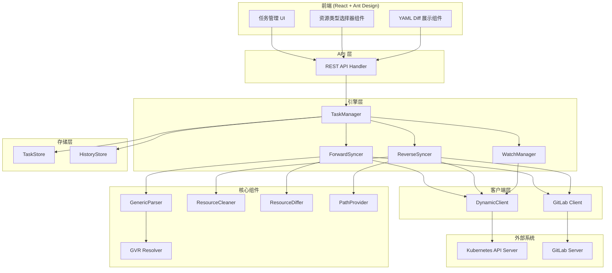
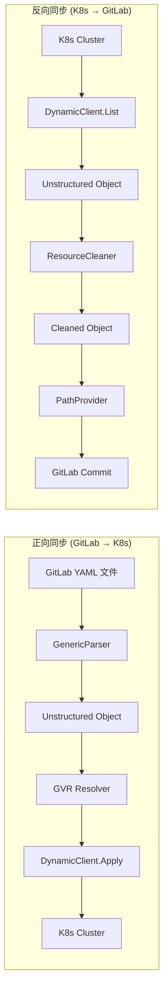
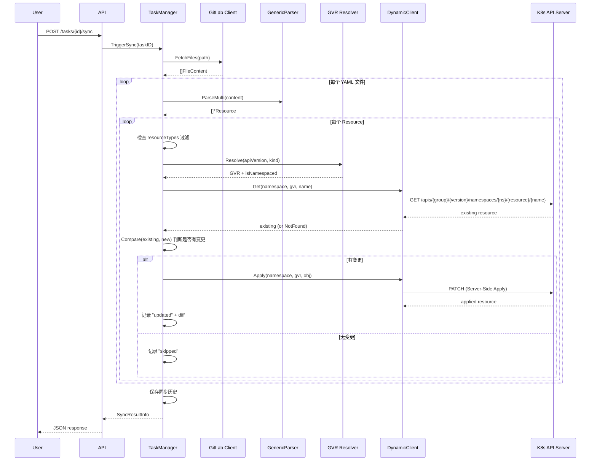
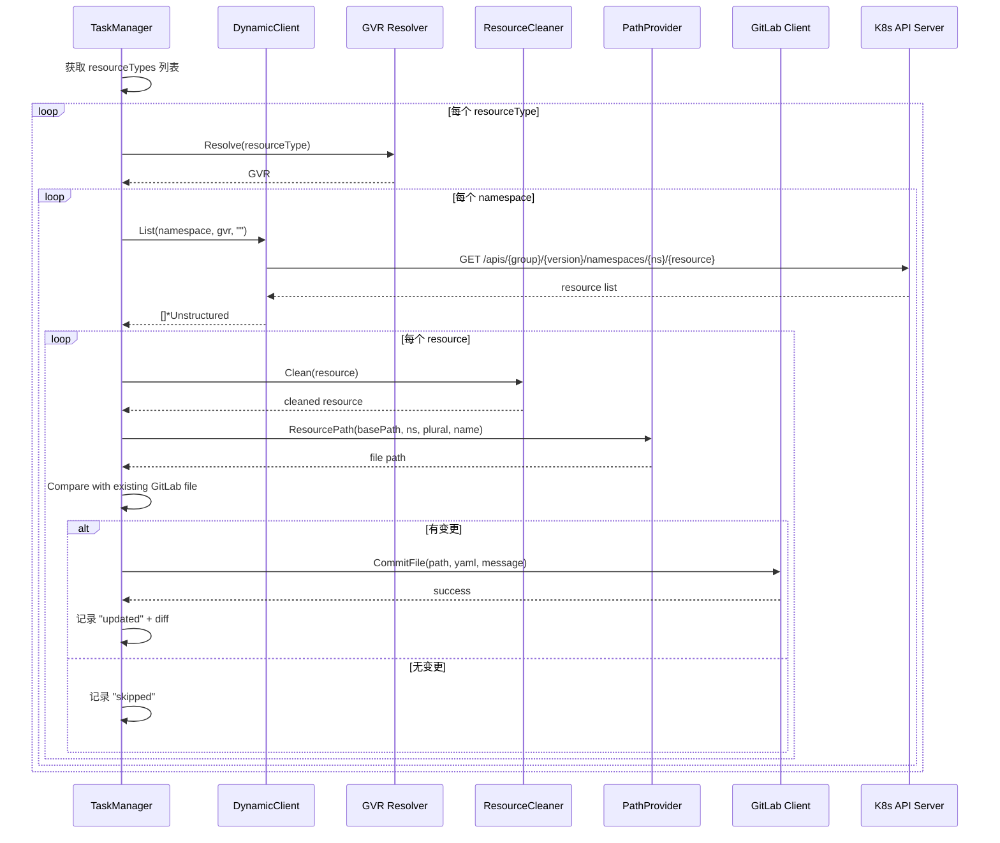
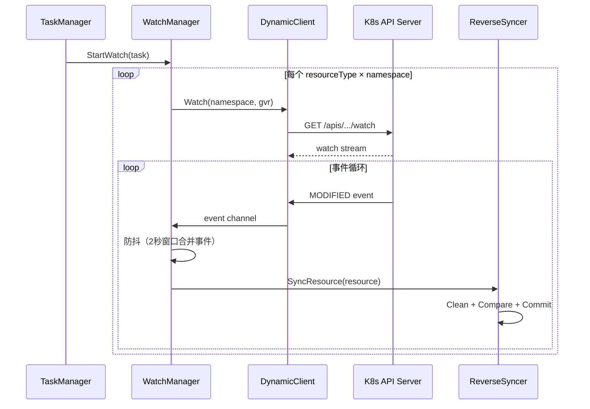

# 技术设计文档：通用 Kubernetes 资源同步

## 概述

本设计文档描述将现有 ConfigMap 专用同步系统升级为通用 Kubernetes 资源同步系统的技术方案。核心创新点在于：

1. **通用资源表示**：使用 `k8s.io/apimachinery/pkg/apis/meta/v1/unstructured.Unstructured` 替代类型化结构体，实现对任意 K8s 资源的统一处理
2. **动态客户端**：使用 `k8s.io/client-go/dynamic` 替代类型化客户端，通过 GVR（GroupVersionResource）动态路由 API 请求
3. **Server-Side Apply**：采用 Kubernetes 服务端应用机制（`application/apply-patch+yaml`），由服务端负责字段合并和冲突检测
4. **运行时字段清理**：可配置的字段路径移除机制，确保导出的 YAML 干净且可重新应用
5. **GVR 智能解析**：内置映射表 + Discovery API 回退的双层解析策略

### 设计目标

- 支持任意 Kubernetes 资源类型的双向同步（GitLab ↔ K8s）
- 保持与现有 ConfigMap 同步任务的完全向后兼容
- 提供清晰的资源类型选择和文件组织规范
- 实现高可靠性的错误处理和重试机制

### 技术栈

| 组件 | 技术选型 | 版本 |
|------|----------|------|
| 通用资源表示 | `k8s.io/apimachinery/pkg/apis/meta/v1/unstructured` | v0.36.0 |
| 动态客户端 | `k8s.io/client-go/dynamic` | v0.36.0 |
| YAML 解析 | `gopkg.in/yaml.v3` + `k8s.io/apimachinery/pkg/util/yaml` | - |
| 资源发现 | `k8s.io/client-go/discovery` | v0.36.0 |
| 前端框架 | React + Ant Design | 现有 |

## 架构

### 系统架构总览



### 数据流架构



### 模块依赖关系

```mermaid
graph TD
    engine[internal/engine] --> generic_parser[internal/parser/generic]
    engine --> dynamic_client[internal/k8s/dynamic]
    engine --> resource_cleaner[internal/k8s/cleaner]
    engine --> resource_differ[internal/diff]
    engine --> path_provider[internal/path]
    engine --> gitlab_client[internal/gitlab]
    engine --> history_store[internal/history]
    engine --> task_store[internal/store]

    dynamic_client --> gvr_resolver[internal/k8s/gvr]
    generic_parser --> gvr_resolver

    api[internal/api] --> engine
    api --> task_store

    gvr_resolver --> discovery[k8s.io/client-go/discovery]
    dynamic_client --> k8s_dynamic[k8s.io/client-go/dynamic]


## 组件与接口

### 1. 通用 YAML 解析器 (`internal/parser/generic`)

```go
package generic

import (
    "k8s.io/apimachinery/pkg/apis/meta/v1/unstructured"
)

// Resource 表示一个解析后的通用 K8s 资源
type Resource struct {
    Object    *unstructured.Unstructured
    APIVersion string
    Kind       string
    Name       string
    Namespace  string
    GVR        schema.GroupVersionResource
}

// Parser 通用 YAML 解析器接口
type Parser interface {
    // Parse 解析单个 YAML 文档为 Resource
    Parse(content []byte) (*Resource, error)
    // ParseMulti 解析多文档 YAML（以 --- 分隔）为 Resource 列表
    ParseMulti(content []byte) ([]*Resource, error)
    // Print 将 Resource 格式化为 YAML 文本
    Print(resource *Resource) ([]byte, error)
}
```

### 2. GVR 解析器 (`internal/k8s/gvr`)

```go
package gvr

import (
    "k8s.io/apimachinery/pkg/runtime/schema"
    "k8s.io/client-go/discovery"
)

// Resolver 负责将 apiVersion/kind 映射到 GVR
type Resolver interface {
    // Resolve 将 apiVersion 和 kind 解析为 GVR
    // 优先使用内置映射表，未命中时通过 Discovery API 查询
    Resolve(apiVersion, kind string) (schema.GroupVersionResource, bool, error)
    // IsNamespaced 判断资源是否为命名空间级别
    IsNamespaced(gvr schema.GroupVersionResource) bool
    // RefreshCache 刷新 Discovery API 缓存
    RefreshCache() error
}

// 内置 GVR 映射表（部分示例）
var builtinMapping = map[string]schema.GroupVersionResource{
    "v1/ConfigMap":                    {Group: "", Version: "v1", Resource: "configmaps"},
    "v1/Secret":                       {Group: "", Version: "v1", Resource: "secrets"},
    "v1/Service":                      {Group: "", Version: "v1", Resource: "services"},
    "v1/ServiceAccount":               {Group: "", Version: "v1", Resource: "serviceaccounts"},
    "v1/PersistentVolumeClaim":        {Group: "", Version: "v1", Resource: "persistentvolumeclaims"},
    "apps/v1/Deployment":              {Group: "apps", Version: "v1", Resource: "deployments"},
    "apps/v1/StatefulSet":             {Group: "apps", Version: "v1", Resource: "statefulsets"},
    "apps/v1/DaemonSet":               {Group: "apps", Version: "v1", Resource: "daemonsets"},
    "batch/v1/CronJob":                {Group: "batch", Version: "v1", Resource: "cronjobs"},
    "batch/v1/Job":                    {Group: "batch", Version: "v1", Resource: "jobs"},
    "networking.k8s.io/v1/Ingress":    {Group: "networking.k8s.io", Version: "v1", Resource: "ingresses"},
    "networking.k8s.io/v1/NetworkPolicy": {Group: "networking.k8s.io", Version: "v1", Resource: "networkpolicies"},
    "rbac.authorization.k8s.io/v1/Role":           {Group: "rbac.authorization.k8s.io", Version: "v1", Resource: "roles"},
    "rbac.authorization.k8s.io/v1/RoleBinding":    {Group: "rbac.authorization.k8s.io", Version: "v1", Resource: "rolebindings"},
    "rbac.authorization.k8s.io/v1/ClusterRole":    {Group: "rbac.authorization.k8s.io", Version: "v1", Resource: "clusterroles"},
    "rbac.authorization.k8s.io/v1/ClusterRoleBinding": {Group: "rbac.authorization.k8s.io", Version: "v1", Resource: "clusterrolebindings"},
    "autoscaling/v2/HorizontalPodAutoscaler": {Group: "autoscaling", Version: "v2", Resource: "horizontalpodautoscalers"},
}
```

### 3. Dynamic Client (`internal/k8s/dynamic`)

```go
package dynamic

import (
    "context"
    "k8s.io/apimachinery/pkg/apis/meta/v1/unstructured"
    "k8s.io/apimachinery/pkg/runtime/schema"
    "k8s.io/apimachinery/pkg/watch"
)

// Client 通用 Kubernetes 动态客户端接口
type Client interface {
    // Apply 使用 Server-Side Apply 将资源应用到集群
    // fieldManager 标识应用者身份，force=true 时强制覆盖冲突
    Apply(ctx context.Context, namespace string, gvr schema.GroupVersionResource, obj *unstructured.Unstructured) error

    // Get 从集群获取指定资源
    Get(ctx context.Context, namespace string, gvr schema.GroupVersionResource, name string) (*unstructured.Unstructured, error)

    // List 列出指定命名空间和类型的所有资源
    List(ctx context.Context, namespace string, gvr schema.GroupVersionResource, labelSelector string) ([]*unstructured.Unstructured, error)

    // Delete 从集群删除指定资源
    Delete(ctx context.Context, namespace string, gvr schema.GroupVersionResource, name string) error

    // Watch 监听指定命名空间和类型的资源变更
    Watch(ctx context.Context, namespace string, gvr schema.GroupVersionResource) (watch.Interface, error)
}
```

**Server-Side Apply 实现细节：**

```go
// Apply 使用 Server-Side Apply
func (c *client) Apply(ctx context.Context, namespace string, gvr schema.GroupVersionResource, obj *unstructured.Unstructured) error {
    data, err := json.Marshal(obj)
    if err != nil {
        return err
    }

    var resource dynamic.ResourceInterface
    if namespace != "" {
        resource = c.dynamic.Resource(gvr).Namespace(namespace)
    } else {
        resource = c.dynamic.Resource(gvr)
    }

    _, err = resource.Patch(ctx, obj.GetName(), types.ApplyPatchType, data, metav1.PatchOptions{
        FieldManager: "configmap-sync",
        Force:        ptr.To(true),
    })
    return err
}
```

### 4. 运行时字段清理器 (`internal/k8s/cleaner`)

```go
package cleaner

import "k8s.io/apimachinery/pkg/apis/meta/v1/unstructured"

// Cleaner 运行时字段清理器接口
type Cleaner interface {
    // Clean 移除 Unstructured 对象中的运行时字段
    Clean(obj *unstructured.Unstructured) *unstructured.Unstructured
}

// 需要移除的字段路径
var runtimeFieldPaths = []string{
    "status",
    "metadata.managedFields",
    "metadata.resourceVersion",
    "metadata.uid",
    "metadata.creationTimestamp",
    "metadata.generation",
    "metadata.selfLink",
}

// 需要从 metadata.annotations 中移除的键
var runtimeAnnotationKeys = []string{
    "kubectl.kubernetes.io/last-applied-configuration",
}

// 需要从 metadata.annotations 中移除的前缀
var runtimeAnnotationPrefixes = []string{
    "kubernetes.io/",
    "k8s.io/",
    "control-plane.alpha.kubernetes.io/",
}
```

### 5. 资源差异比较器 (`internal/diff`)

```go
package diff

import "k8s.io/apimachinery/pkg/apis/meta/v1/unstructured"

// DiffResult 差异比较结果
type DiffResult struct {
    HasDiff     bool          `json:"hasDiff"`
    FieldDiffs  []FieldDiff   `json:"fieldDiffs,omitempty"`
    OldYAML     string        `json:"oldYaml,omitempty"`
    NewYAML     string        `json:"newYaml,omitempty"`
}

// FieldDiff 字段级差异
type FieldDiff struct {
    Path     string `json:"path"`     // 字段路径，如 "spec.replicas"
    OldValue string `json:"oldValue"`
    NewValue string `json:"newValue"`
    Type     string `json:"type"`     // "added", "modified", "deleted"
}

// Differ 资源差异比较器接口
type Differ interface {
    // Compare 比较两个资源的差异（忽略运行时字段）
    Compare(old, new *unstructured.Unstructured) *DiffResult
}
```

### 6. 路径提供器 (`internal/path`)

```go
package path

// Provider 文件路径生成器接口
type Provider interface {
    // ResourcePath 生成资源在 GitLab 中的文件路径
    // 格式: {basePath}/{namespace}/{resourceTypePlural}/{name}.yaml
    // Cluster-scoped: {basePath}/_cluster/{resourceTypePlural}/{name}.yaml
    ResourcePath(basePath, namespace, resourceTypePlural, name string, isNamespaced bool) string

    // ParsePath 从文件路径解析出命名空间、资源类型和名称
    ParsePath(filePath, basePath string) (namespace, resourceType, name string, err error)
}
```

## 数据模型

### 扩展后的 SyncTask

```json
{
  "id": "task-uuid",
  "name": "sync-all-resources",
  "sourceName": "my-gitlab",
  "targetName": "prod-cluster",
  "direction": "forward",
  "syncMode": "scheduled",
  "interval": 60,
  "resourceTypes": ["ConfigMap", "Secret", "Deployment", "Service", "CronJob"],
  "status": "running",
  "lastSyncTime": "2024-01-15T10:30:00Z",
  "lastSyncResult": "成功: 15/20 已同步",
  "errorMessage": ""
}
```

### 扩展后的 SyncRecord

```json
{
  "id": "record-uuid",
  "timestamp": "2024-01-15T10:30:00Z",
  "taskName": "sync-all-resources",
  "configMapName": "15/20 synced",
  "namespace": "default",
  "direction": "forward",
  "changeType": "sync",
  "status": "Synced",
  "details": [
    {
      "name": "my-deployment",
      "namespace": "default",
      "kind": "Deployment",
      "group": "apps",
      "action": "updated",
      "oldYaml": "apiVersion: apps/v1\nkind: Deployment\n...",
      "newYaml": "apiVersion: apps/v1\nkind: Deployment\n...",
      "changes": [
        {"key": "spec.replicas", "oldValue": "2", "newValue": "3", "type": "modified"}
      ]
    }
  ]
}
```

### GitLab 文件组织结构

```
{base_path}/
├── default/
│   ├── configmaps/
│   │   ├── app-config.yaml
│   │   └── nginx-config.yaml
│   ├── secrets/
│   │   └── db-credentials.yaml
│   ├── deployments/
│   │   ├── web-app.yaml
│   │   └── api-server.yaml
│   ├── services/
│   │   ├── web-app-svc.yaml
│   │   └── api-server-svc.yaml
│   └── cronjobs/
│       └── cleanup-job.yaml
├── monitoring/
│   ├── deployments/
│   │   └── prometheus.yaml
│   └── services/
│       └── prometheus-svc.yaml
└── _cluster/
    ├── clusterroles/
    │   └── admin-role.yaml
    └── clusterrolebindings/
        └── admin-binding.yaml
```

## 关键流程序列图

### 正向同步流程



### 反向同步流程



### Watch 自动同步流程



## 正确性属性

### 属性 1：YAML 往返一致性

*对于任意*合法的 Kubernetes 资源 YAML 文件，通过 GenericParser 解析后再通过 Print 格式化，再次解析应产生与首次解析语义等价的 Unstructured 对象。

**验证需求：1.7**

### 属性 2：GVR 解析确定性

*对于任意*相同的 apiVersion/kind 输入，GVR Resolver 应始终返回相同的 GVR 结果。

**验证需求：2.1, 2.2**

### 属性 3：运行时字段清理幂等性

*对于任意* Unstructured 对象，对其执行两次 Clean 操作应产生与执行一次相同的结果。

**验证需求：12.1-12.12**

### 属性 4：清理后可重新应用

*对于任意*从集群导出并清理后的资源 YAML，重新应用到集群不应产生验证错误（不移除必要字段）。

**验证需求：12.12**

### 属性 5：资源类型过滤正确性

*对于任意*资源列表和 resourceTypes 过滤器，过滤后的结果应仅包含 Kind 在 resourceTypes 中的资源。

**验证需求：4.3, 5.2**

### 属性 6：路径生成唯一性

*对于任意*两个不同的资源（不同 namespace/kind/name 组合），PathProvider 生成的文件路径应不同。

**验证需求：9.1, 9.2, 9.3**

### 属性 7：路径往返一致性

*对于任意*通过 ResourcePath 生成的路径，通过 ParsePath 解析应能还原出原始的 namespace、resourceType 和 name。

**验证需求：9.1, 9.4**

### 属性 8：差异比较对称性

*对于任意*两个资源 A 和 B，Compare(A, B) 报告有差异当且仅当 Compare(B, A) 也报告有差异。

**验证需求：8.1**

### 属性 9：无变更不提交

*对于任意*内容相同的资源（清理运行时字段后），反向同步不应向 GitLab 提交新的 commit。

**验证需求：6.5**

### 属性 10：向后兼容性

*对于任意*不含 resourceTypes 字段的旧 SyncTask，系统应将其视为仅同步 ConfigMap 类型。

**验证需求：13.1**

## 错误处理策略

| 错误场景 | 处理方式 | 影响范围 |
|---------|----------|---------|
| YAML 解析失败 | 跳过该文件，记录错误到同步结果 | 单个文件 |
| GVR 解析失败（未知资源类型） | 跳过该资源，记录警告 | 单个资源 |
| K8s API 401/403 | 不重试，记录权限错误 | 单个资源 |
| K8s API 404（资源类型不存在） | 跳过该类型，记录警告 | 单个资源类型 |
| K8s API 网络超时 | 指数退避重试（最多3次） | 单个操作 |
| K8s API 409 冲突 | Server-Side Apply Force=true 覆盖 | 单个资源 |
| GitLab API 失败 | 记录错误，继续处理其他资源 | 单个资源 |
| Watch 连接断开 | 指数退避重连（最大5分钟） | 单个 watch |
| 连续3次同步失败 | 任务状态设为 error | 整个任务 |

## 测试策略

### 属性测试

使用 `pgregory.net/rapid` 进行属性测试，每个属性至少 200 次迭代。

| 属性 | 测试文件 |
|------|---------|
| 属性 1 | `internal/parser/generic/parser_prop_test.go` |
| 属性 2 | `internal/k8s/gvr/resolver_prop_test.go` |
| 属性 3 | `internal/k8s/cleaner/cleaner_prop_test.go` |
| 属性 5 | `internal/engine/filter_prop_test.go` |
| 属性 6, 7 | `internal/path/provider_prop_test.go` |
| 属性 9 | `internal/engine/sync_prop_test.go` |
| 属性 10 | `internal/engine/compat_prop_test.go` |

### 单元测试

- GenericParser：各种资源类型的解析、多文档解析、错误输入
- GVR Resolver：内置映射命中、Discovery API 回退、缓存过期
- ResourceCleaner：各种资源类型的清理、边界情况
- DynamicClient：Server-Side Apply、重试逻辑、错误处理
- PathProvider：各种路径生成和解析场景
- ResourceDiffer：各种差异类型、Secret 脱敏

### 集成测试

- 使用 `k8s.io/client-go/kubernetes/fake` 模拟 K8s API
- 使用 Mock HTTP Server 模拟 GitLab API
- 端到端同步流程验证
