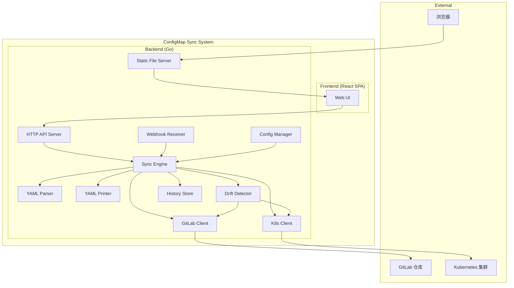
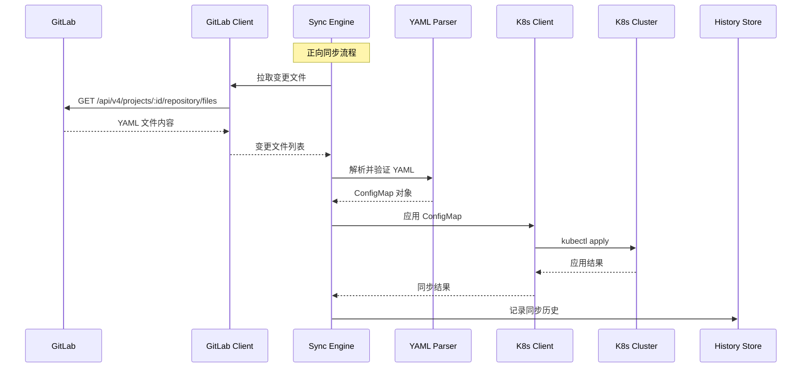
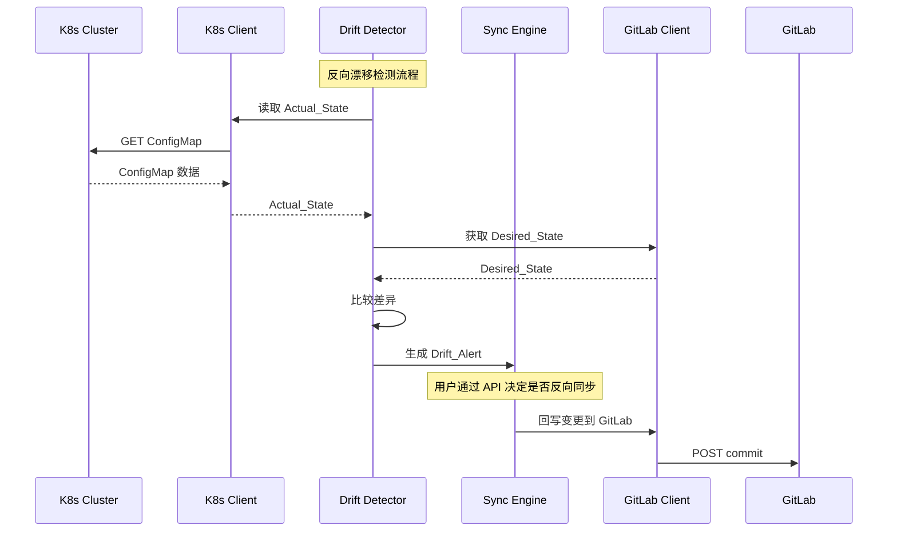

# 技术设计文档：K8s ConfigMap YAML 同步系统

## 概述

本系统是一个基于 Go 语言的轻量级双向 ConfigMap 同步工具，以 GitLab 仓库中的 YAML 文件作为配置权威来源（Source of Truth），实现 GitLab ↔ Kubernetes 集群之间的 ConfigMap 配置同步。

系统采用模块化架构，核心组件包括：GitLab 客户端、YAML 解析/格式化器、K8s 客户端、同步引擎、漂移检测器、历史记录存储、HTTP API 服务和 Web 前端界面。正向同步支持三种触发模式（自动/定时/手动），反向同步通过漂移检测主动提示用户决策。Web 前端提供 ConfigMap 管理、YAML 展示/对比、同步操作和漂移告警管理等可视化功能，前端构建产物通过 Go embed 包嵌入后端二进制，实现单一二进制部署。

技术选型：
- 后端语言：Go 1.22+（K8s 生态标准语言，丰富的 client-go 库支持）
- K8s 交互：`k8s.io/client-go`
- GitLab 交互：`github.com/xanzy/go-gitlab`
- YAML 解析：`gopkg.in/yaml.v3`
- HTTP 框架：`net/http` + `github.com/gorilla/mux`
- 配置管理：`gopkg.in/yaml.v3`（直接解析 YAML 配置文件）
- 属性测试：`pgregory.net/rapid`
- 前端框架：React 18 + TypeScript
- 前端构建：Vite
- UI 组件库：Ant Design
- YAML Diff 展示：`react-diff-viewer-continued`（并排 diff 视图）
- YAML 语法高亮：`react-syntax-highlighter`（基于 Prism.js）
- HTTP 请求：`axios`
- 前端路由：`react-router-dom`
- 静态文件嵌入：Go `embed` 包

## 架构

### 整体架构



### 组件交互流程






## 组件与接口

### 1. Config Manager (`internal/config`)

负责加载和验证系统配置。

```go
// Config 系统配置
type Config struct {
    GitLab    GitLabConfig    `yaml:"gitlab"`
    K8s       K8sConfig       `yaml:"k8s"`
    Sync      SyncConfig      `yaml:"sync"`
    Drift     DriftConfig     `yaml:"drift"`
    History   HistoryConfig   `yaml:"history"`
    API       APIConfig       `yaml:"api"`
}

// LoadConfig 从文件加载配置，应用默认值，验证必填项
func LoadConfig(path string) (*Config, error)

// Validate 验证配置合法性
func (c *Config) Validate() error
```

### 2. YAML Parser (`internal/parser`)

负责 YAML 文件的解析、验证和格式化。

```go
// ConfigMapData 解析后的 ConfigMap 结构
type ConfigMapData struct {
    APIVersion string            `yaml:"apiVersion"`
    Kind       string            `yaml:"kind"`
    Metadata   Metadata          `yaml:"metadata"`
    Data       map[string]string `yaml:"data"`
}

// Parse 将 YAML 文本解析为 ConfigMapData
func Parse(content []byte) (*ConfigMapData, error)

// Validate 验证 ConfigMapData 是否符合 K8s ConfigMap 规范
func Validate(cm *ConfigMapData) error

// Print 将 ConfigMapData 格式化为 YAML 文本
func Print(cm *ConfigMapData) ([]byte, error)
```

### 3. GitLab Client (`internal/gitlab`)

封装 GitLab API 交互。

```go
type Client interface {
    // FetchFiles 拉取指定路径下的 YAML 文件
    FetchFiles(ctx context.Context, path string) ([]FileContent, error)
    // CheckChanges 检查自上次同步以来的文件变更
    CheckChanges(ctx context.Context, since string) ([]FileChange, error)
    // CommitFile 将变更提交到 GitLab
    CommitFile(ctx context.Context, path string, content []byte, message string) error
}
```

### 4. K8s Client (`internal/k8s`)

封装 Kubernetes API 交互。

```go
type Client interface {
    // ApplyConfigMap 将 ConfigMap 应用到集群
    ApplyConfigMap(ctx context.Context, namespace string, cm *v1.ConfigMap) error
    // GetConfigMap 从集群获取 ConfigMap
    GetConfigMap(ctx context.Context, namespace, name string) (*v1.ConfigMap, error)
    // ListConfigMaps 列出命名空间下所有被管理的 ConfigMap
    ListConfigMaps(ctx context.Context, namespace string) ([]*v1.ConfigMap, error)
    // DeleteConfigMap 从集群删除 ConfigMap
    DeleteConfigMap(ctx context.Context, namespace, name string) error
}
```

### 5. Sync Engine (`internal/engine`)

核心同步协调器。

```go
type Engine interface {
    // ForwardSync 执行正向同步（GitLab → K8s）
    ForwardSync(ctx context.Context, opts ForwardSyncOptions) (*SyncResult, error)
    // ForwardSyncOne 同步单个 ConfigMap
    ForwardSyncOne(ctx context.Context, namespace, name string) (*SyncResult, error)
    // ReverseSync 执行反向同步（K8s → GitLab）
    ReverseSync(ctx context.Context, namespace, name string) (*SyncResult, error)
    // CheckGitLabChanges 检查 GitLab 变更
    CheckGitLabChanges(ctx context.Context) (*ChangeCheckResult, error)
    // GetManagedConfigMaps 获取所有被管理的 ConfigMap 状态
    GetManagedConfigMaps(ctx context.Context) ([]ConfigMapStatus, error)
    // GetConfigMapDetail 获取单个 ConfigMap 详情（含 diff）
    GetConfigMapDetail(ctx context.Context, namespace, name string) (*ConfigMapDetail, error)
}

type ForwardSyncOptions struct {
    // FileChanges 指定要同步的文件变更（Auto 模式使用）
    FileChanges []FileChange
    // FullSync 是否全量同步（Scheduled/Manual 模式使用）
    FullSync bool
}
```

### 6. Drift Detector (`internal/drift`)

漂移检测器，周期性比较 Desired_State 与 Actual_State。

```go
type Detector interface {
    // Start 启动漂移检测循环
    Start(ctx context.Context) error
    // Stop 停止漂移检测
    Stop()
    // GetAlerts 获取未处理的漂移告警
    GetAlerts() []DriftAlert
    // DismissAlert 忽略指定告警
    DismissAlert(id string) error
    // ResolveAlert 标记告警为已解决
    ResolveAlert(id string) error
}
```

### 7. History Store (`internal/history`)

同步历史记录存储。

```go
type Store interface {
    // Save 保存同步记录
    Save(record *SyncRecord) error
    // Query 按条件查询同步记录
    Query(filter QueryFilter) ([]SyncRecord, error)
    // Flush 将内存缓存写入磁盘
    Flush() error
}

type QueryFilter struct {
    Name      string
    Namespace string
    Direction string // "forward" | "reverse"
    Since     *time.Time
    Until     *time.Time
}
```

### 8. Webhook Receiver (`internal/webhook`)

接收 GitLab Push Event Webhook。

```go
type Receiver interface {
    // Handler 返回 HTTP handler 用于注册到路由
    Handler() http.Handler
    // Events 返回接收到的事件通道
    Events() <-chan PushEvent
}
```

### 9. HTTP API Server (`internal/api`)

REST API 服务。

```go
// 路由定义
// GET    /api/v1/configmaps                          - 列出所有 ConfigMap
// GET    /api/v1/configmaps/{namespace}/{name}        - 获取 ConfigMap 详情
// POST   /api/v1/forward-sync                         - 触发全量正向同步
// POST   /api/v1/forward-sync/{namespace}/{name}      - 触发单个 ConfigMap 正向同步
// POST   /api/v1/reverse-sync/{namespace}/{name}      - 触发反向同步
// GET    /api/v1/drift-alerts                          - 获取漂移告警列表
// POST   /api/v1/drift-alerts/{id}/dismiss             - 忽略漂移告警
// GET    /api/v1/history                               - 查询同步历史
// POST   /api/v1/check-gitlab                          - 触发 GitLab 变更检查
```

### 10. Static File Server (`internal/api`)

将前端 SPA 构建产物嵌入 Go 二进制并提供静态文件服务。

```go
import "embed"

//go:embed web/dist/*
var frontendFS embed.FS

// RegisterStaticRoutes 注册静态文件路由
// - 匹配 /api/ 前缀的请求交给 API handler 处理
// - 匹配静态资源文件（.js, .css, .png 等）的请求返回对应文件
// - 其他所有请求回退到 index.html（支持 SPA 前端路由）
func RegisterStaticRoutes(router *mux.Router)
```

### 11. Web Frontend (`web/`)

基于 React + TypeScript + Vite 的单页应用。

#### 前端项目结构

```
web/
├── index.html
├── package.json
├── tsconfig.json
├── vite.config.ts
└── src/
    ├── main.tsx                  # 应用入口
    ├── App.tsx                   # 根组件，路由配置
    ├── api/
    │   └── client.ts             # Axios 封装，统一 API 调用
    ├── pages/
    │   ├── ConfigMapList.tsx      # ConfigMap 列表页
    │   ├── ConfigMapDetail.tsx    # ConfigMap 详情 + YAML Diff 页
    │   ├── DriftAlerts.tsx        # 漂移告警页
    │   └── SyncHistory.tsx        # 同步历史页
    └── components/
        ├── YamlDiffView.tsx       # YAML 并排 Diff 组件
        ├── YamlHighlight.tsx      # YAML 语法高亮组件
        ├── SyncStatusBadge.tsx    # 同步状态标签组件
        └── ErrorAlert.tsx         # 错误提示组件
```

#### 页面路由

| 路由路径 | 页面组件 | 功能 |
|---------|---------|------|
| `/` | `ConfigMapList` | ConfigMap 列表，展示同步状态，提供全量同步和 GitLab 变更检查操作 |
| `/configmaps/:namespace/:name` | `ConfigMapDetail` | ConfigMap 详情，YAML 内容展示，并排 Diff 对比，单个 ConfigMap 同步 |
| `/drift-alerts` | `DriftAlerts` | 漂移告警列表，支持反向同步和忽略操作 |
| `/history` | `SyncHistory` | 同步历史记录，支持过滤查询 |

#### 核心组件接口

```typescript
// api/client.ts - API 客户端
const apiClient = axios.create({ baseURL: '/api/v1' });

export const api = {
  getConfigMaps: () => apiClient.get<ConfigMapStatus[]>('/configmaps'),
  getConfigMapDetail: (ns: string, name: string) =>
    apiClient.get<ConfigMapDetail>(`/configmaps/${ns}/${name}`),
  forwardSync: () => apiClient.post('/forward-sync'),
  forwardSyncOne: (ns: string, name: string) =>
    apiClient.post(`/forward-sync/${ns}/${name}`),
  reverseSync: (ns: string, name: string) =>
    apiClient.post(`/reverse-sync/${ns}/${name}`),
  getDriftAlerts: () => apiClient.get<DriftAlert[]>('/drift-alerts'),
  dismissAlert: (id: string) => apiClient.post(`/drift-alerts/${id}/dismiss`),
  getHistory: (params: HistoryFilter) =>
    apiClient.get<SyncRecord[]>('/history', { params }),
  checkGitLab: () => apiClient.post('/check-gitlab'),
};

// components/YamlDiffView.tsx - YAML Diff 组件
interface YamlDiffViewProps {
  oldValue: string;   // Desired_State YAML
  newValue: string;   // Actual_State YAML
  leftTitle?: string; // 左侧标题，默认 "GitLab (Desired)"
  rightTitle?: string;// 右侧标题，默认 "K8s (Actual)"
}

// components/YamlHighlight.tsx - YAML 语法高亮组件
interface YamlHighlightProps {
  code: string;       // YAML 内容
  showLineNumbers?: boolean;
}
```

#### 前端构建与集成

```bash
# 开发模式（代理 API 到后端）
cd web && npm run dev

# 生产构建（输出到 web/dist/）
cd web && npm run build

# 后端编译时自动嵌入前端产物
go build -o configmap-sync ./cmd/server
```

Vite 开发模式配置代理：

```typescript
// vite.config.ts
export default defineConfig({
  server: {
    proxy: {
      '/api': 'http://localhost:8080',
    },
  },
  build: {
    outDir: 'dist',
  },
});
```


## 数据模型

### ConfigMapData

```go
type ConfigMapData struct {
    APIVersion string            `yaml:"apiVersion" json:"apiVersion"`
    Kind       string            `yaml:"kind" json:"kind"`
    Metadata   Metadata          `yaml:"metadata" json:"metadata"`
    Data       map[string]string `yaml:"data" json:"data"`
}

type Metadata struct {
    Name        string            `yaml:"name" json:"name"`
    Namespace   string            `yaml:"namespace" json:"namespace"`
    Labels      map[string]string `yaml:"labels,omitempty" json:"labels,omitempty"`
    Annotations map[string]string `yaml:"annotations,omitempty" json:"annotations,omitempty"`
}
```

### FileChange

```go
type FileChange struct {
    Path       string     `json:"path"`
    ChangeType ChangeType `json:"changeType"` // "added", "modified", "deleted"
    Content    []byte     `json:"-"`
}

type ChangeType string

const (
    ChangeAdded    ChangeType = "added"
    ChangeModified ChangeType = "modified"
    ChangeDeleted  ChangeType = "deleted"
)
```

### SyncRecord

```go
type SyncRecord struct {
    ID            string    `json:"id"`
    Timestamp     time.Time `json:"timestamp"`
    ConfigMapName string    `json:"configMapName"`
    Namespace     string    `json:"namespace"`
    Direction     string    `json:"direction"` // "forward" | "reverse"
    ChangeType    string    `json:"changeType"`
    Status        string    `json:"status"` // "Synced", "Failed", "Pending"
    BeforeSummary string    `json:"beforeSummary"`
    AfterSummary  string    `json:"afterSummary"`
    ErrorMessage  string    `json:"errorMessage,omitempty"`
}
```

### DriftAlert

```go
type DriftAlert struct {
    ID            string    `json:"id"`
    ConfigMapName string    `json:"configMapName"`
    Namespace     string    `json:"namespace"`
    DiffFields    []string  `json:"diffFields"`
    DetectedAt    time.Time `json:"detectedAt"`
    Status        string    `json:"status"` // "Pending", "Dismissed", "Resolved"
}
```

### ConfigMapStatus

```go
type ConfigMapStatus struct {
    Name          string    `json:"name"`
    Namespace     string    `json:"namespace"`
    SyncStatus    string    `json:"syncStatus"` // "Synced", "Pending", "Failed", "Drifted"
    LastSyncTime  time.Time `json:"lastSyncTime"`
}
```

### ConfigMapDetail

```go
type ConfigMapDetail struct {
    Name         string            `json:"name"`
    Namespace    string            `json:"namespace"`
    DesiredState map[string]string `json:"desiredState"`
    ActualState  map[string]string `json:"actualState"`
    Diff         []DiffEntry       `json:"diff"`
    SyncStatus   string            `json:"syncStatus"`
    LastSyncTime time.Time         `json:"lastSyncTime"`
}

type DiffEntry struct {
    Field    string `json:"field"`
    Expected string `json:"expected"`
    Actual   string `json:"actual"`
}
```

### Config

```go
type Config struct {
    GitLab  GitLabConfig  `yaml:"gitlab"`
    K8s     K8sConfig     `yaml:"k8s"`
    Sync    SyncConfig    `yaml:"sync"`
    Drift   DriftConfig   `yaml:"drift"`
    History HistoryConfig `yaml:"history"`
    API     APIConfig     `yaml:"api"`
}

type GitLabConfig struct {
    URL          string `yaml:"url"`
    Token        string `yaml:"token"`
    ProjectID    int    `yaml:"projectId"`
    Branch       string `yaml:"branch"`       // 默认 "main"
    Path         string `yaml:"path"`         // 默认 "/"
    WebhookSecret string `yaml:"webhookSecret"`
}

type K8sConfig struct {
    Kubeconfig string `yaml:"kubeconfig"` // 默认使用 ~/.kube/config
    Namespace  string `yaml:"namespace"`  // 默认 "default"
}

type SyncConfig struct {
    Mode     string `yaml:"mode"`     // "auto", "scheduled", "manual"，默认 "manual"
    Interval int    `yaml:"interval"` // 定时同步间隔（秒），默认 300
}

type DriftConfig struct {
    Interval int `yaml:"interval"` // 漂移检测间隔（秒），默认 60
}

type HistoryConfig struct {
    StoragePath string `yaml:"storagePath"` // 默认 "~/.configmap-sync/history"
}

type APIConfig struct {
    Port int `yaml:"port"` // 默认 8080
}
```


## 正确性属性

*属性（Property）是指在系统所有合法执行中都应成立的特征或行为——本质上是对系统应做什么的形式化陈述。属性是人类可读规格说明与机器可验证正确性保证之间的桥梁。*

### 属性 1：YAML 文件扩展名过滤

*对于任意*文件列表，GitLab_Client 拉取的结果应仅包含扩展名为 `.yaml` 或 `.yml` 的文件，其他扩展名的文件不应出现在结果中。

**验证需求：1.1**

### 属性 2：变更检测完整性

*对于任意*一组远程文件版本和本地缓存版本的组合，GitLab_Client 的变更检测应正确识别所有新增、修改和删除的文件，且每个变更报告包含文件路径和变更类型。

**验证需求：1.2, 1.3**

### 属性 3：Webhook 签名验证

*对于任意* HTTP 请求，若其签名与配置的 Secret Token 不匹配，Webhook_Receiver 应返回 HTTP 403 状态码。

**验证需求：1.7**

### 属性 4：Webhook 事件触发正向同步

*对于任意*合法的 GitLab Push Event，若事件涉及目标分支上的 YAML 文件变更，Webhook_Receiver 应通知 Sync_Engine 触发 Forward_Sync。

**验证需求：1.6**

### 属性 5：YAML 往返一致性

*对于任意*合法的 ConfigMap 对象，先通过 YAML_Printer 格式化为 YAML 文本，再通过 YAML_Parser 解析，应产生与原始对象等价的结果。

**验证需求：2.1, 2.2, 2.5, 2.6**

### 属性 6：非法 YAML 错误报告

*对于任意*不合法的 YAML 输入（包括语法错误和结构不符合 ConfigMap 规范），YAML_Parser 应返回包含错误位置信息的错误，不应返回成功结果。

**验证需求：2.3, 2.4**

### 属性 7：指定 ConfigMap 同步范围

*对于任意*一组待同步的变更和指定的目标 ConfigMap（namespace/name），ForwardSyncOne 应仅同步该指定的 ConfigMap，不影响其他 ConfigMap。

**验证需求：3.2**

### 属性 8：同步状态正确反映结果

*对于任意*同步操作，若 K8s 应用成功则状态应为 "Synced"；若 K8s 通信失败且重试 3 次后仍失败，则状态应为 "Failed"。

**验证需求：3.3, 3.5, 3.6**

### 属性 9：非法文件跳过

*对于任意*一批待同步文件，其中 YAML_Parser 验证失败的文件应被跳过，验证成功的文件应正常同步。

**验证需求：3.4**

### 属性 10：Auto 模式仅同步 Webhook 指定文件

*对于任意* Webhook 事件中包含的变更文件集合，Auto 模式下的 Forward_Sync 应仅同步该集合中的文件，而非全量同步。

**验证需求：3.8**

### 属性 11：Webhook 事件合并

*对于任意*短时间内收到的多个 Push Event，Sync_Engine 应将它们合并为一次 Forward_Sync 执行，合并后的文件集合应为所有事件涉及文件的并集。

**验证需求：3.9**

### 属性 12：无变更时跳过同步

*对于任意*定时同步周期，若 GitLab 检测到无新变更，Sync_Engine 不应执行 Forward_Sync。

**验证需求：3.12**

### 属性 13：手动模式变更标记为 Pending

*对于任意*在 Manual 模式下检测到的 GitLab 变更，Sync_Engine 应将其标记为 "Pending" 状态，不自动执行同步。

**验证需求：3.14**

### 属性 14：手动模式 Diff 展示

*对于任意*待同步的变更，Sync_Engine 应生成包含变更字段和变更前后值的差异信息。

**验证需求：3.15**

### 属性 15：漂移检测生成告警

*对于任意* ConfigMap，若其 Actual_State 与 Desired_State 存在差异，Drift_Detector 应生成一条 Drift_Alert，包含 ConfigMap 名称、命名空间、差异字段和检测时间。

**验证需求：4.2**

### 属性 16：DriftAlert 状态转换

*对于任意* DriftAlert，dismiss 操作应将状态变为 "Dismissed"，成功的 Reverse_Sync 应将状态变为 "Resolved"。状态转换应是幂等的。

**验证需求：4.5, 4.6**

### 属性 17：漂移告警 API 仅返回未处理告警

*对于任意*一组混合状态的 DriftAlert，GET /api/v1/drift-alerts 接口应仅返回状态为 "Pending" 的告警。

**验证需求：4.3, 7.5**

### 属性 18：SyncRecord 包含所有必填字段

*对于任意*同步操作（正向或反向），生成的 SyncRecord 应包含时间戳、ConfigMap 名称、命名空间、同步方向、变更类型、同步状态、变更前内容摘要和变更后内容摘要。

**验证需求：5.1**

### 属性 19：SyncRecord JSON 往返一致性

*对于任意* SyncRecord，序列化为 JSON 后再反序列化应产生与原始记录等价的结果。

**验证需求：5.2**

### 属性 20：历史查询过滤与排序

*对于任意*一组 SyncRecord 和任意过滤条件组合（名称、命名空间、方向、时间范围），查询结果应仅包含匹配所有过滤条件的记录，且按时间戳降序排列。

**验证需求：5.3, 5.4**

### 属性 21：配置验证

*对于任意*不合法的配置（缺少必填参数、auto 模式缺少 webhook secret、scheduled 模式 interval < 30 秒、无效的 sync mode 值），Validate 应返回包含具体错误描述的错误。

**验证需求：6.2, 6.4, 6.5, 6.6**

### 属性 22：配置 YAML 解析

*对于任意*合法的配置 YAML 文件，LoadConfig 应正确解析所有配置参数到对应的 Config 结构体字段。

**验证需求：6.1**

### 属性 23：API ConfigMap 列表完整性

*对于任意*一组被管理的 ConfigMap，GET /api/v1/configmaps 返回的列表应包含所有 ConfigMap，且每条记录包含名称、命名空间、同步状态和最近同步时间。

**验证需求：7.2**

### 属性 24：API 错误响应

*对于任意*请求不存在的 ConfigMap 应返回 HTTP 404；*对于任意*参数格式不合法的请求应返回 HTTP 400。

**验证需求：7.7, 7.8**

### 属性 25：静态文件服务 SPA 回退

*对于任意*不匹配 `/api/` 前缀且不匹配静态资源文件的 HTTP 请求路径，Static_File_Server 应返回 index.html 的内容，以支持前端 SPA 路由。

**验证需求：8.15, 8.16**

### 属性 26：API 错误响应前端展示

*对于任意*后端 API 返回的错误响应（HTTP 4xx 或 5xx），Web_UI 应展示包含错误状态码和错误描述的提示信息，不应出现未处理的异常。

**验证需求：8.17, 8.18**


## 错误处理

### 错误分类

| 错误类别 | 示例 | 处理策略 |
|---------|------|---------|
| 网络错误 | GitLab API 超时、K8s API 不可达 | 指数退避重试（最多 3 次），标记连接状态为 Disconnected |
| 认证错误 | GitLab Token 无效、K8s 权限不足 | 记录错误日志，向用户报告认证错误，不重试 |
| 数据验证错误 | YAML 语法错误、ConfigMap 格式不合法 | 跳过该文件，记录具体错误位置和原因 |
| 配置错误 | 缺少必填参数、参数值不合法 | 启动时报告错误并以非零退出码终止 |
| 存储错误 | 历史记录写入失败 | 缓存到内存，待存储恢复后重新写入 |
| Webhook 安全错误 | 签名验证失败 | 返回 HTTP 403，记录错误日志 |

### 重试策略

```go
// RetryConfig 重试配置
type RetryConfig struct {
    MaxRetries  int           // 最大重试次数：3
    BaseDelay   time.Duration // 基础延迟：1s
    MaxDelay    time.Duration // 最大延迟：30s
    Multiplier  float64       // 退避倍数：2.0
}

// 重试延迟计算：delay = min(BaseDelay * Multiplier^attempt, MaxDelay)
```

### 错误传播

- 组件内部错误通过 Go 标准 `error` 接口向上传播
- 使用 `fmt.Errorf` 包装错误以保留上下文信息
- API 层将内部错误转换为适当的 HTTP 状态码和 JSON 错误响应
- 所有错误均通过结构化日志记录（使用 `log/slog`）

## 测试策略

### 双重测试方法

本系统采用单元测试与属性测试相结合的双重测试策略：

- **单元测试**：验证具体示例、边界情况和错误条件
- **属性测试**：验证在所有输入上都成立的通用属性

两者互补，共同提供全面的测试覆盖。

### 属性测试

使用 `pgregory.net/rapid` 作为 Go 语言的属性测试库。

**配置要求**：
- 每个属性测试至少运行 100 次迭代
- 每个属性测试必须通过注释引用设计文档中的属性编号
- 注释格式：`// Feature: k8s-configmap-sync, Property {number}: {property_text}`
- 每个正确性属性由一个属性测试实现

**属性测试覆盖范围**：

| 属性编号 | 测试文件 | 测试内容 |
|---------|---------|---------|
| 属性 1 | `internal/gitlab/client_prop_test.go` | 文件扩展名过滤 |
| 属性 2 | `internal/gitlab/client_prop_test.go` | 变更检测完整性 |
| 属性 3 | `internal/webhook/receiver_prop_test.go` | Webhook 签名验证 |
| 属性 4 | `internal/webhook/receiver_prop_test.go` | Webhook 事件触发同步 |
| 属性 5 | `internal/parser/parser_prop_test.go` | YAML 往返一致性 |
| 属性 6 | `internal/parser/parser_prop_test.go` | 非法 YAML 错误报告 |
| 属性 7 | `internal/engine/engine_prop_test.go` | 指定 ConfigMap 同步范围 |
| 属性 8 | `internal/engine/engine_prop_test.go` | 同步状态反映结果 |
| 属性 9 | `internal/engine/engine_prop_test.go` | 非法文件跳过 |
| 属性 10 | `internal/engine/engine_prop_test.go` | Auto 模式同步范围 |
| 属性 11 | `internal/engine/engine_prop_test.go` | Webhook 事件合并 |
| 属性 12 | `internal/engine/engine_prop_test.go` | 无变更跳过同步 |
| 属性 13 | `internal/engine/engine_prop_test.go` | 手动模式 Pending 标记 |
| 属性 14 | `internal/engine/engine_prop_test.go` | 手动模式 Diff 展示 |
| 属性 15 | `internal/drift/detector_prop_test.go` | 漂移检测生成告警 |
| 属性 16 | `internal/drift/detector_prop_test.go` | DriftAlert 状态转换 |
| 属性 17 | `internal/drift/detector_prop_test.go` | 漂移告警过滤 |
| 属性 18 | `internal/history/store_prop_test.go` | SyncRecord 字段完整性 |
| 属性 19 | `internal/history/store_prop_test.go` | SyncRecord JSON 往返 |
| 属性 20 | `internal/history/store_prop_test.go` | 历史查询过滤与排序 |
| 属性 21 | `internal/config/config_prop_test.go` | 配置验证 |
| 属性 22 | `internal/config/config_prop_test.go` | 配置 YAML 解析 |
| 属性 23 | `internal/api/handler_prop_test.go` | API ConfigMap 列表 |
| 属性 24 | `internal/api/handler_prop_test.go` | API 错误响应 |
| 属性 25 | `internal/api/static_prop_test.go` | 静态文件服务 SPA 回退 |

### 单元测试

单元测试聚焦于具体示例和边界情况：

| 测试文件 | 测试内容 |
|---------|---------|
| `internal/gitlab/client_test.go` | GitLab API 回写（1.4）、认证失败处理（1.8）、网络超时处理（1.9） |
| `internal/webhook/receiver_test.go` | Auto 模式下 Webhook 监听启动（1.5） |
| `internal/engine/engine_test.go` | 正向同步完整流程（3.1）、Auto 模式触发（3.7）、定时同步周期（3.10, 3.11）、手动模式限制（3.13） |
| `internal/drift/detector_test.go` | 漂移检测周期运行（4.1）、反向同步触发（4.4）、回写失败保留 Pending（4.7） |
| `internal/history/store_test.go` | 写入失败内存缓存（5.5） |
| `internal/config/config_test.go` | 默认配置值（6.3） |
| `internal/api/handler_test.go` | API 服务启动（7.1）、GitLab 变更检查触发（7.6） |
| `internal/api/static_test.go` | 静态文件嵌入服务（8.14）、SPA 路由回退（8.16） |
| `web/src/__tests__/ConfigMapList.test.tsx` | ConfigMap 列表展示（8.1）、全量同步按钮（8.6）、GitLab 变更检查按钮（8.8） |
| `web/src/__tests__/ConfigMapDetail.test.tsx` | YAML 内容展示（8.3）、Diff 视图（8.4）、语法高亮（8.5）、单个同步按钮（8.7） |
| `web/src/__tests__/DriftAlerts.test.tsx` | 告警列表展示（8.9）、反向同步按钮（8.10）、忽略按钮（8.11） |
| `web/src/__tests__/SyncHistory.test.tsx` | 历史记录展示（8.12）、过滤查询（8.13） |
| `web/src/__tests__/ErrorAlert.test.tsx` | API 错误展示（8.17）、网络错误重试（8.18） |

### 测试依赖

外部依赖（GitLab API、Kubernetes API）通过接口抽象，测试中使用 mock 实现：

```go
// 使用接口定义的 GitLab Client 和 K8s Client 便于 mock
type MockGitLabClient struct { ... }
type MockK8sClient struct { ... }
```

### 测试运行

```bash
# 运行所有后端测试
go test ./...

# 运行属性测试（指定迭代次数）
go test ./... -rapid.checks=200

# 运行特定包的测试
go test ./internal/parser/...

# 运行前端测试
cd web && npm test -- --run

# 运行前端特定测试
cd web && npm test -- --run src/__tests__/ConfigMapList.test.tsx
```
